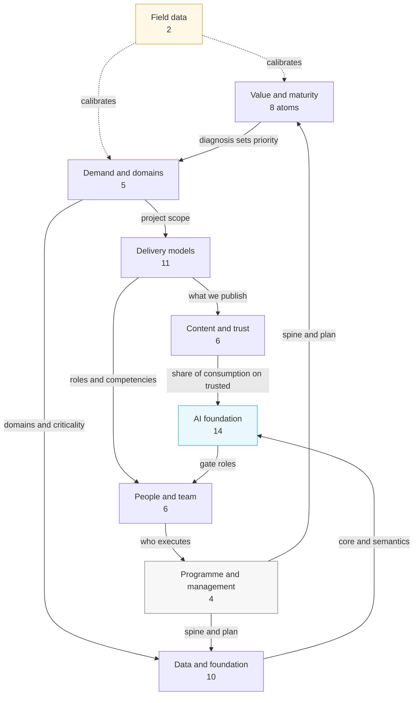
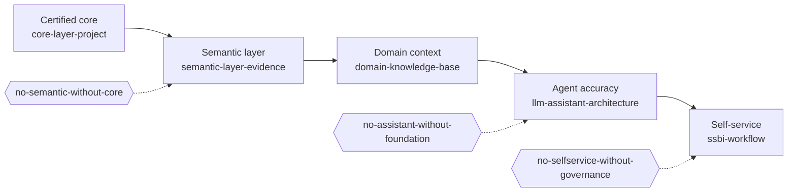
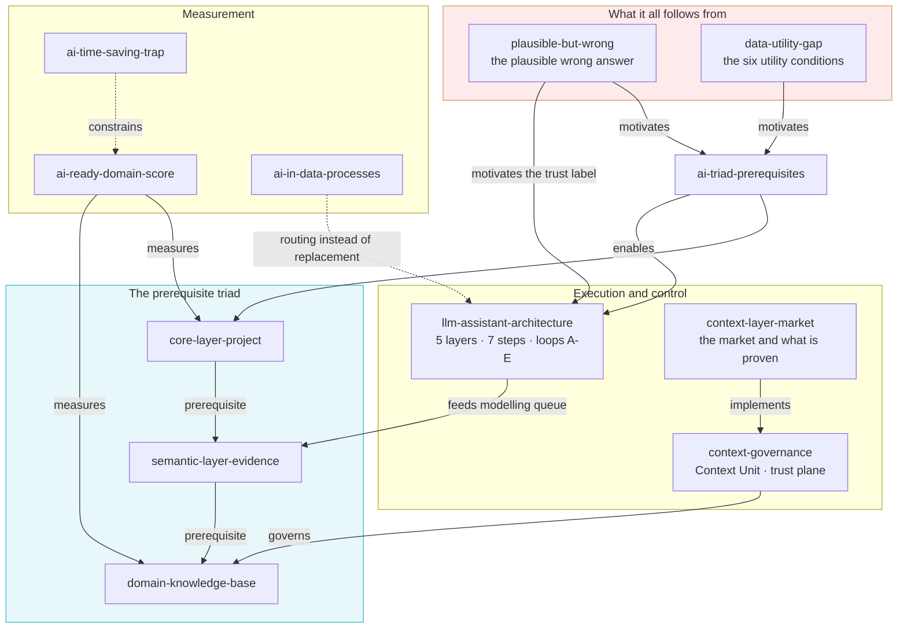
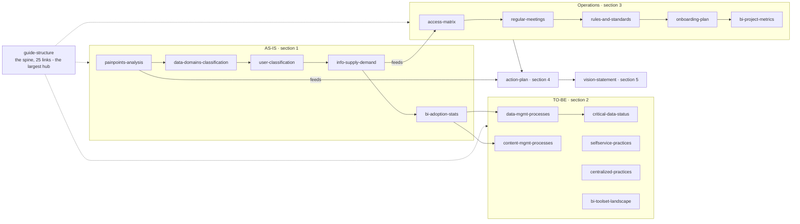
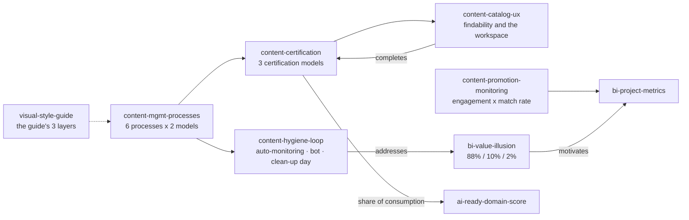
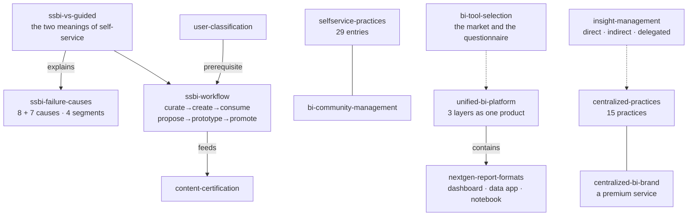
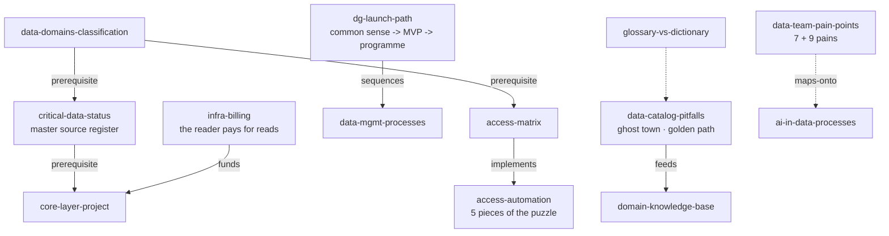
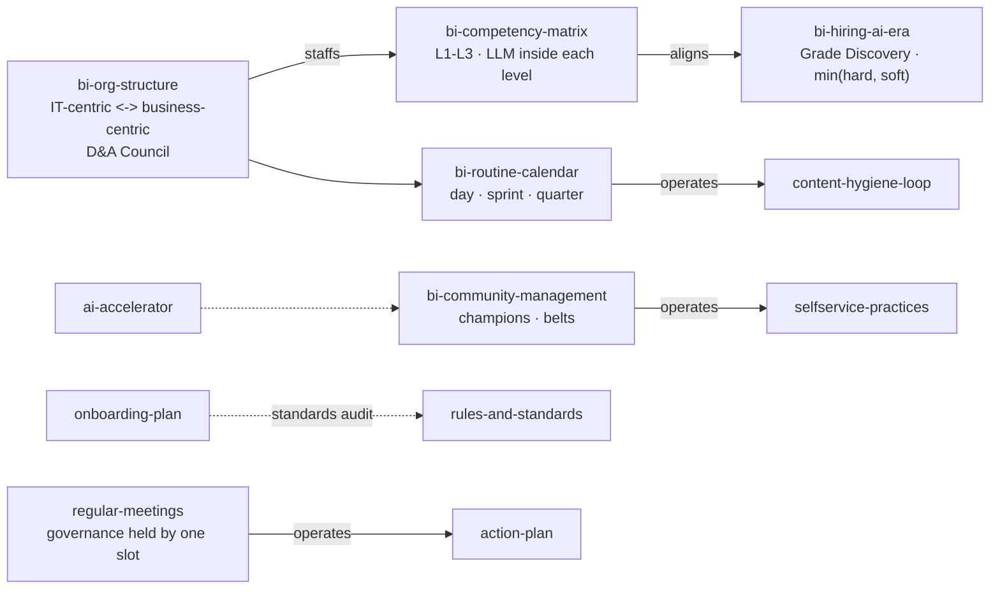
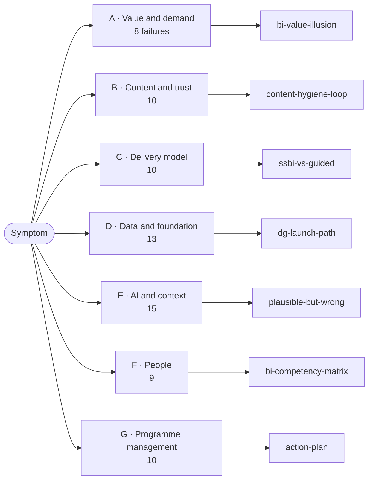
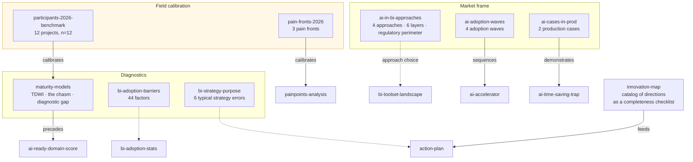

# Visual theme graph

Rendered from `30-graph.yaml`. **Solid arrows** are the curated typed relations from the `relations` section. **Dotted arrows** are relations inferred from the content, living in the atoms as ordinary Obsidian wiki-links.

The full undirected graph has 66 nodes and 283 edges with no isolates. It is broken into readable views below, because a single diagram of 66 nodes is unreadable.

## 1. Clusters and how they rest on one another

## 2. The dependency chain — the budget-defence line

An order that cannot be rearranged. An initiative standing behind an unpassed link yields zero, not a reduced effect.

## 3. The AI foundation — the principal cluster

## 4. The method spine — the order of work through the guide

## 5. Content: from publication to an agent's trust

## 6. Delivery models

## 7. Data, governance and economics

## 8. People and programme management

## 9. The "something is wrong with us" entry

The families from `50-failure-catalog.md` and where they lead.

## 10. Diagnostics, calibration and the market frame

Nine nodes that do not fit the earlier diagrams: they feed the input rather than sit on the chain.

---

**How to read the assembly order.** Field data calibrates expectations → the value and maturity diagnosis sets the priority → demand defines the scope → domains and criticality set the foundation → the triad is built one layer at a time with an eval before and after → content and self-service go on top of a finished foundation rather than alongside it → people and regular management keep it all alive beyond a quarter.
