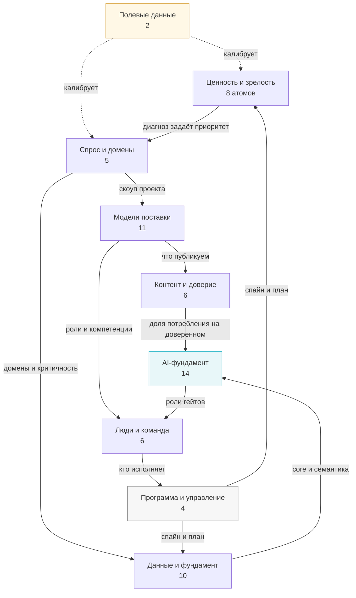
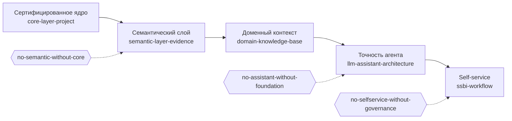
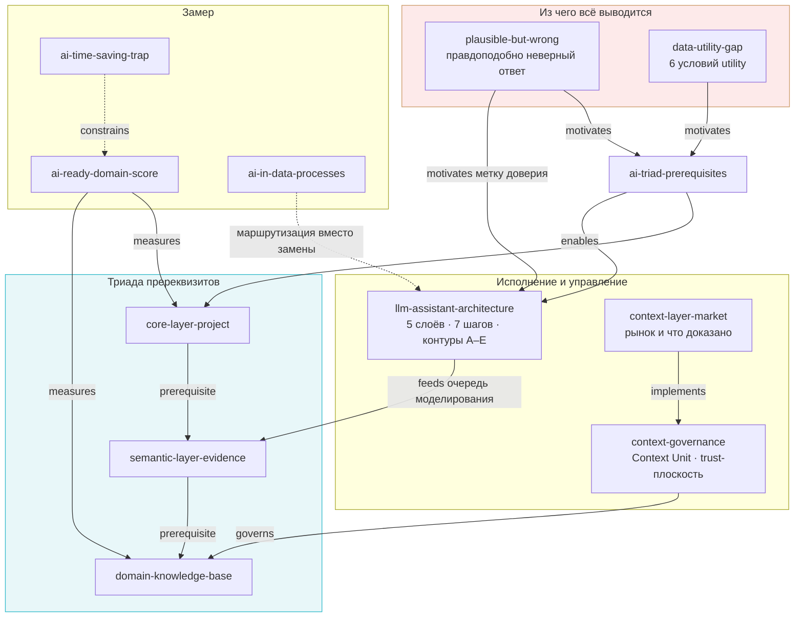
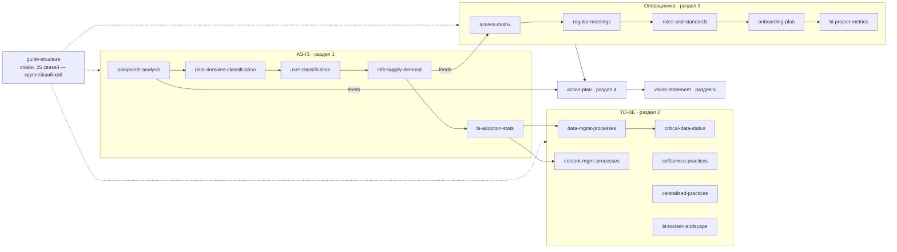
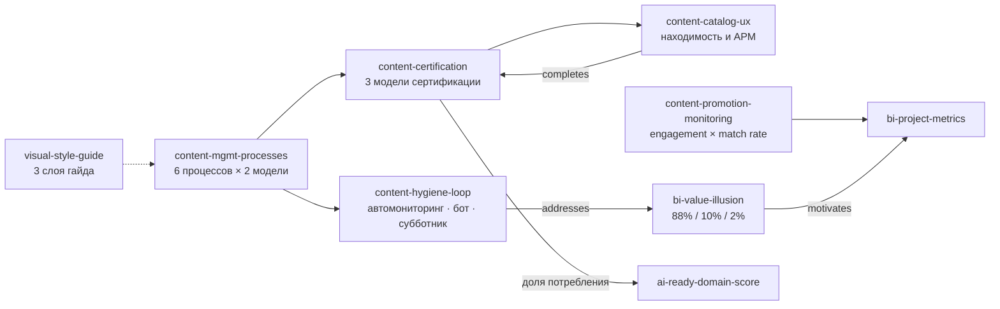
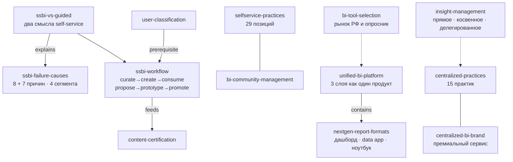
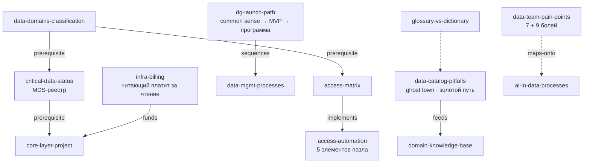
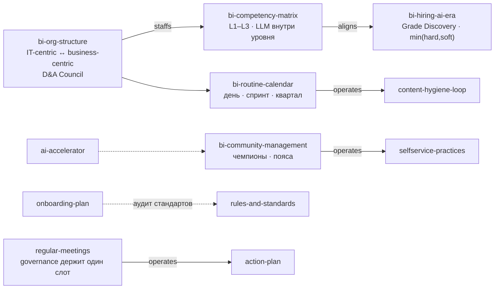
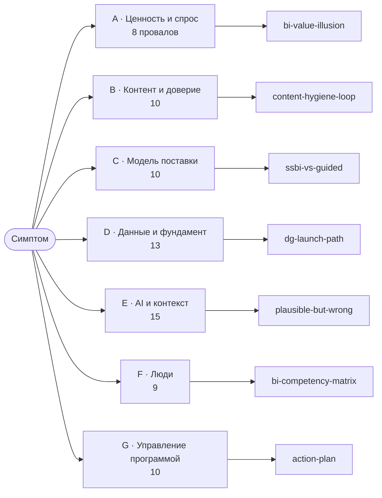
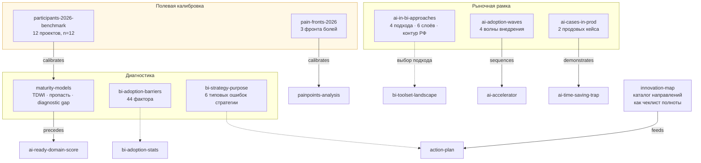

# Визуальный граф тем

Рендер `30-graph.yaml`. **Сплошные стрелки** — курируемые типизированные связи из секции `relations`. **Пунктир** — связи, выведенные из содержания и живущие в атомах как `[[wiki-ссылки]]`.

Полный ненаправленный граф — 66 узлов и 283 ребра, изолированных нет; ниже он разложен на читаемые виды, потому что одна схема на 66 узлов нечитаема.

## 1. Кластеры и как они опираются друг на друга

## 2. Цепочка зависимостей — линия защиты бюджета

Порядок, который нельзя переставить. Инициатива, стоящая за непройденным звеном, даёт ноль, а не уменьшенный эффект.

## 3. AI-фундамент — главный кластер

## 4. Спайн метода — порядок работы с гайдом

## 5. Контент: от публикации до доверия агента

## 6. Модели поставки

## 7. Данные, governance и экономика

## 8. Люди и управление программой

## 9. Вход «у нас что-то не так»

Семейства из `50-failure-catalog.md` и куда они ведут.

## 10. Диагностика, калибровка и рыночная рамка

Девять узлов, которые не ложатся в предыдущие схемы: они питают вход, а не строятся по цепочке.

---

**Как читать порядок сборки стратегии.** Полевые данные калибруют ожидания → диагностика ценности и зрелости даёт приоритет → спрос определяет скоуп → домены и критичность задают фундамент → триада строится по одному слою за раз с eval до и после → контент и self-service идут поверх готового фундамента, а не параллельно ему → люди и регулярный менеджмент удерживают всё это дольше квартала.
